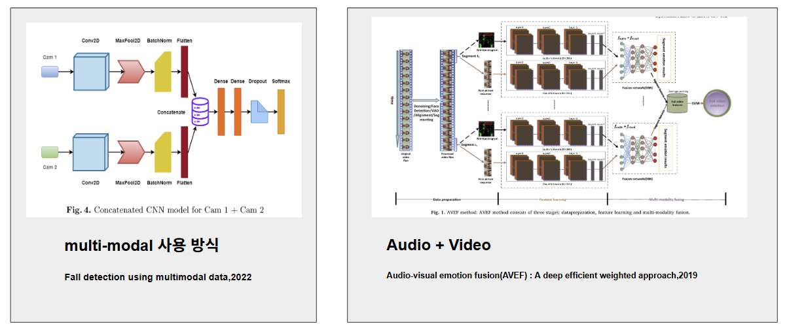
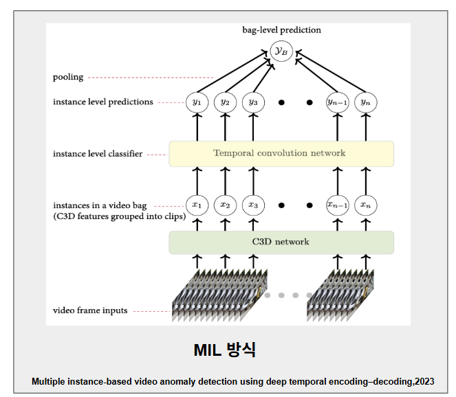
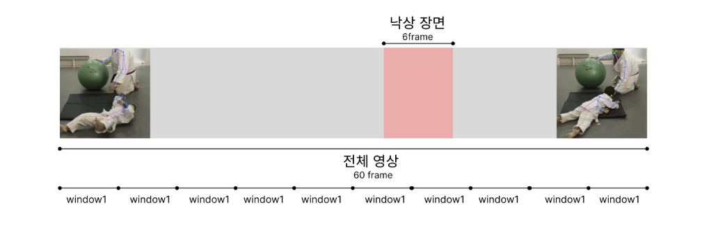
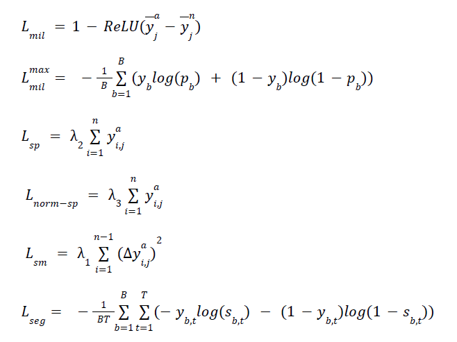

# Multimodal Fall Detection & Risk Alert Service
**멀티모달 기반 노인의 낙상 감지 및 위험 알림 서비스**

## Overview
본 프로젝트는 멀티모달 낙상 감지 시스템을 개발하여, **영상(시각 정보)** 과 **오디오(음향 정보)** 를 함께 활용해 노인의 낙상 여부를 판별하고 위험 알림을 지원합니다. 또한 실제 낙상은 보통 긴 영상 안에서 짧은 구간에만 발생하고, 데이터 라벨이 대개 **비디오 단위(거친 라벨)** 로만 제공되는 한계가 있어, 이를 해결하기 위해 **Multiple Instance Learning(MIL)** 기반의 약지도 학습을 적용했습니다. 즉, 하나의 영상을 Bag으로 보고, 이를 구성하는 짧은 클립/세그먼트를 Instance로 취급합니다. **Bag이 낙상(Positive)** 이라면, 그 안의 적어도 하나의 Instance는 낙상일 것으로 가정하여 학습을 진행합니다.

## Reference

## Pipeline

## Training

## Loss Functions

---

## Summary
| Setting | Audio Condition | Core Loss / Method | Accuracy | F1 |
|---|---|---|---:|---:|
| A | Audio | Mean-separation MIL | 1.0 | 1.0 |
| B | Audio | Mean-separation + Sparsity + Normal Suppression | 1.0 | 1.0 |
| C | Audio | Mean-separation + Sparsity + Normal + Smoothness + Agreement | 1.0 | 1.0 |
| D | Muted | (C) on muted-audio data | 0.4762 | 0.0 |
| E | Muted | Max-pooling MIL + Sparsity + Normal + Smoothness + Agreement | 0.4762 | 0.0 |
| F | Audio | Max-pooling MIL + Sparsity + Normal + Smoothness + Agreement | 1.0 | 1.0 |
| G | Muted | (E) + Segment-level BCE | 1.0 | 1.0 |
| H | Audio | (F) + Segment-level BCE | 0.47 | 0.0 |

실험 결과, 총 8가지 설정 중 6가지(1,2,3,6,7 등)에서 테스트 정확도 1.0이 나왔다. 나머지 방식에 대한 test 결과는 전부 양성으로 예측하기에 출력값을 보고 이에 대한 threshold를 바꿔보는 방식으로 추후에 test 해봐야 할 것 같다. threshold 조정과 loss가 충분히 감소하지 않는데도 정확도가 높게 나오는 현상이 관찰되어 모델 출력값과 학습 과정을 분석해 원인을 분석해야 한다. 마지막으로 데이터 구성이 계속 달라 비교가 어려웠으므로, 이후에는 동일한 데이터셋으로 고정해 실험을 반복하여 공정하게 결과를 비교할 예정이다.

## Dataset
- AIHub : <a href="https://www.aihub.or.kr/aihubdata/data/view.do?currMenu=115&topMenu=100&dataSetSn=71641">낙상사고 위험동작 영상-센서 쌍 데이터<a>
